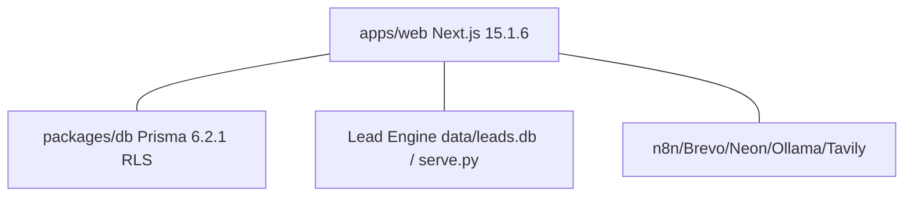

# Architecture — Acquisition OS Control Center

## High-level

```
WAVES → ACQUISITION OS (Acquisition / Enrichment / Qualification / Outreach / Campaigns / Agents / Workflows / Analytics / Document Engine)
      → app.wavesco.in → CONTROL CENTER (Monitor / Configure / Execute / Pause / Resume / Analyze / Manage)
      → Postgres Neon (RLS wavesco_app) + Lead Engine dual-mode + n8n + Brevo/SMTP + Ollama/AI Gateway
```

Control flow: `app.wavesco.in → Authenticated Dashboard (middleware.ts) → Acquisition OS API (requireControlAuth → requireTenantId → withTenantContext) → Orchestration → DB + External APIs`. Dashboard never exposes provider keys to browser.

## Components

| Layer | Location | Key files |
|-------|----------|-----------|
| Web App | `apps/web/app/(dashboard)/acquisition/*` (10 pages) + `app/api/acquisition/*` (10 APIs) + `app/api/system/*` | `page.tsx` (overview/leads/campaigns/workflows/agents/integrations/reports/email/analytics/system), `control.ts`, `lead-engine.ts`, `integrations.ts`, `n8n.ts`, `components/control/confirm-dialog.tsx` |
| DB | `packages/db/prisma/schema.prisma` (24 models, `DATABASE_URL` + `DIRECT_URL`, `withTenantContext SET LOCAL app.tenant_id`) | `LeadResearch/OutreachOrder/GenerationBatch/Campaign` etc., `ClientAiConfig/AiUsageLog/AuditLog` |
| Lead Engine | `D:\wavesco-lead-engine` (standalone, not git) | `data/leads.db` + `engine/*.py` (discovery/research/scoring/enrich_ai/excel_outreach/pdf_report/notify) + `serve.py` HTTP API |
| Ext | n8n, Brevo, Neon, Ollama Cloud, Tavily, Sheets | `N8N_BASE_URL` REST `/api/v1/workflows`, Brevo webhook `api/webhooks/brevo`, Ollama `https://ollama.com/v1` |

Mermaid (system):


## Request lifecycle (control action)

1. `middleware.ts` guards `(dashboard)/*` → redirect `/login` if unauth.
2. Page `export const dynamic="force-dynamic"` server component calls `auth()` + `requireTenantId`.
3. DB read via `withTenantContext(tenantId, tx => tx.campaign.count({ where:{tenantId}}))`.
4. Control POST → `requireControlAuth()` → state-machine validation → `withTenantContext` mutation → `auditControl({ tenantId, userId, action, model, recordId, before, after })` → `AuditLog`.
5. Page `AutoRefresh intervalMs={15000|30000}` (`router.refresh()`) polls live state; destructive actions via `ConfirmDialog` with before/after preview.

## Data flow (leads)

`Lead Engine leads.db` (source of truth, never copied) ↔ `LeadResearch` snapshot (unique [tenantId,leadKey]) ↔ `OutreachOrder` (versioned) ↔ `OutreachEmail` queue ↔ `n8n Approval Queue` (`POST /webhook/personal/approval`) ↔ `Email Outbox`/`Brevo` ↔ `LeadLifecycleEvent` observability ↔ `ActivityEvent` feed ↔ `GenerationBatch` reports.

## Modules

`acquisition-os@1.0.0` (7 tables, 17 actions, audit true), `automation-os@1.0.0` (IntegrationStatus, n8n), `client-os@1.0.0` (Client/Project/Task). See Master Dossier §6.

## Infra

Vercel `waves-c0-app` (alias `app.wavesco.in`, build `pnpm --filter @wavesco/db db:generate && next build && node scripts/copy-prisma-engine.mjs`), Neon Postgres (pooled `wavesco_app` + `DIRECT_URL` migration), local `docker-compose.yml` Postgres 16 :5433.

